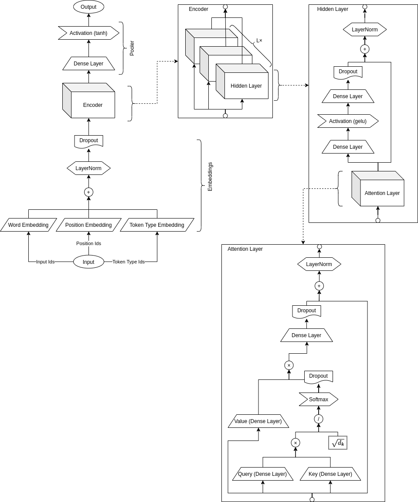

# 🎯 Sentiment Analysis Using RoBERTa Transformer

> A production-grade **Twitter Sentiment Analysis** pipeline built with the **RoBERTa** (Robustly Optimized BERT Approach) transformer model from Hugging Face. This project fine-tunes a pre-trained RoBERTa model on a Twitter dataset to classify tweets into **Positive**, **Negative**, and **Neutral** sentiments.

---

## 📑 Table of Contents

- [About the Project](#about-the-project)
- [What is RoBERTa Transformer?](#what-is-roberta-transformer)
- [How RoBERTa Works (Simple Explanation)](#how-roberta-works-simple-explanation)
- [Project Architecture](#project-architecture)
- [Project Structure](#project-structure)
- [Code Explanation](#code-explanation)
- [Installation & Setup](#installation--setup)
- [How to Run](#how-to-run)
- [Configuration](#configuration)
- [Results](#results)
- [Technologies Used](#technologies-used)
- [Author](#author)

---

## 📖 About the Project

This project performs **Sentiment Analysis** on Twitter data. Sentiment Analysis is the process of understanding whether a piece of text (like a tweet) is expressing a **positive**, **negative**, or **neutral** opinion.

### Why is Sentiment Analysis Important?

- **Business**: Companies analyze customer feedback to improve products.
- **Social Media Monitoring**: Track public opinion on trending topics.
- **Politics**: Understand voter sentiment during elections.
- **Customer Support**: Automatically detect unhappy customers.

### What This Project Does

1. **Loads** Twitter dataset (tweets with sentiment labels).
2. **Cleans** the text (removes URLs, @mentions, extra spaces).
3. **Fine-tunes** a pre-trained RoBERTa transformer model on the data.
4. **Evaluates** the model's performance with accuracy, classification report, and confusion matrix.
5. **Saves** the trained model for future use.

---

## 🤖 What is RoBERTa Transformer?

### Simple Explanation

Imagine you want to teach a computer to understand human emotions in text. **RoBERTa** is like a super-smart student that has already read millions of books and articles. It already understands language very well. We just need to teach it one more thing — **"How to detect sentiments in tweets."** This process is called **fine-tuning**.

### Technical Explanation

**RoBERTa** stands for **R**obustly **O**ptimized **BERT** **A**pproach. It was developed by **Facebook AI Research (FAIR)** in 2019 as an improvement over Google's BERT model.

| Feature | BERT | RoBERTa |
|---------|------|---------|
| Training Data | 16GB (BookCorpus + Wikipedia) | 160GB (much more data) |
| Training Method | Static Masking | Dynamic Masking |
| Next Sentence Prediction | Yes | Removed (not helpful) |
| Batch Size | 256 | 8,000 (much larger) |
| Performance | Good | Better on all benchmarks |

### Key Improvements of RoBERTa over BERT

1. **More Training Data**: RoBERTa was trained on **10x more data** than BERT.
2. **Dynamic Masking**: Instead of masking the same words every time (static), RoBERTa changes the masked words in each training pass (dynamic). This helps the model learn better.
3. **No Next Sentence Prediction (NSP)**: BERT tried to predict if two sentences follow each other. RoBERTa removed this task because it didn't help. This made training more efficient.
4. **Larger Batch Size**: Training with bigger batches helps the model learn patterns faster.

---

## 🧠 How RoBERTa Works (Simple Explanation)

### Step-by-Step Process

```
Input Tweet: "I love this product! It's amazing 😍"
        ↓
┌─────────────────────────────┐
│   1. TOKENIZATION           │  → Breaks text into small pieces (tokens)
│   "I", "love", "this",     │     "I love this" → [100, 657, 42, ...]
│   "product", "!", ...       │
└─────────────────────────────┘
        ↓
┌─────────────────────────────┐
│   2. EMBEDDINGS             │  → Converts tokens into numbers (vectors)
│   Word Embedding            │     Each word gets a unique number representation
│ + Position Embedding        │     Also remembers where each word appears
└─────────────────────────────┘
        ↓
┌─────────────────────────────┐
│   3. TRANSFORMER ENCODER    │  → 12 layers of self-attention
│   (Self-Attention)          │     The model looks at ALL words together
│                             │     to understand context and meaning
│   "bank" near "river" →    │     Understands it means riverbank
│   "bank" near "money" →    │     Understands it means financial bank
└─────────────────────────────┘
        ↓
┌─────────────────────────────┐
│   4. CLASSIFICATION HEAD    │  → Decides the sentiment
│   Dense Layer + Softmax     │     Output: [Positive: 0.92, Negative: 0.03,
│                             │              Neutral: 0.05]
└─────────────────────────────┘
        ↓
Output: "Positive" ✅
```

### What is Self-Attention?

Self-Attention is the **secret power** of transformers. It allows the model to look at **every word in the sentence simultaneously** and decide which words are most important for understanding the meaning.

For example, in the sentence:
> *"The movie was not good"*

- A simple model might see "good" and think it's positive.
- But with **self-attention**, the model sees "not" + "good" together and correctly predicts **negative** sentiment.

### The Architecture (Visual)



The architecture diagram above shows:
- **Input Layer**: Takes in tokens (words broken into pieces)
- **Embedding Layer**: Word Embedding + Position Embedding + Token Type Embedding
- **Encoder Stack**: Multiple transformer layers with self-attention and feed-forward networks
- **Hidden Layers**: Each has Attention → Dense → LayerNorm → Dropout
- **Attention Layer**: Uses Query, Key, Value mechanism with Softmax
- **Output/Pooler**: Final classification through Dense layer and activation

---

## 🏗️ Project Architecture

```
┌──────────────────────────────────────────────────────────┐
│                      main.py                             │
│              (Entry Point - Starts Everything)           │
└──────────────────────┬───────────────────────────────────┘
                       │
                       ▼
┌──────────────────────────────────────────────────────────┐
│                   pipeline.py                            │
│           (Orchestrator - Connects All Steps)            │
│                                                          │
│   1. Load Data → 2. Preprocess → 3. Train → 4. Evaluate │
└──────┬──────────────┬──────────────┬──────────────┬──────┘
       │              │              │              │
       ▼              ▼              ▼              ▼
┌────────────┐ ┌────────────┐ ┌───────────────┐ ┌──────────┐
│ data_loader│ │preprocessing│ │sentiment_model│ │evaluation│
│    .py     │ │    .py      │ │     .py       │ │   .py    │
│            │ │             │ │               │ │          │
│ Loads CSV  │ │ Cleans text │ │ RoBERTa Model │ │ Accuracy │
│ dataset    │ │ (URLs,      │ │ Training &    │ │ Report   │
│            │ │  mentions)  │ │ Prediction    │ │ Confusion│
└────────────┘ └─────────────┘ └───────────────┘ └──────────┘
```

---

## 📁 Project Structure

```
sentiment_analysis_using_transformer/
│
├── main.py                          # 🚀 Entry point - runs the entire pipeline
├── preprocess_dataset.py            # 🧹 Preprocesses raw CSV data (run first!)
├── check_deps.py                    # ✅ Checks if all required packages are installed
├── requirement.txt                  # 📦 List of Python packages needed
├── roberta_transformer_architecture.png  # 🖼️ Architecture diagram
│
├── config/
│   └── config_processed.yaml        # ⚙️ Configuration file (paths, model params)
│
├── src/                             # 📂 Source code modules
│   ├── data_loader.py               # 📥 Loads and reads the CSV dataset
│   ├── preprocessing.py             # 🧹 Cleans tweet text for the model
│   ├── sentiment_model.py           # 🤖 RoBERTa model (train, predict, save)
│   ├── pipeline.py                  # 🔄 Connects all steps together
│   └── evaluation.py                # 📊 Calculates accuracy and generates reports
│
├── dataset/                         # 📁 Raw Twitter dataset (you need to add this)
│   ├── twitter_training.csv
│   └── twitter_validation.csv
│
├── processed_dataset/               # 📁 Cleaned dataset (generated by preprocess_dataset.py)
│   ├── cleaned_twitter_training.csv
│   └── cleaned_twitter_validation.csv
│
├── results/                         # 📁 Model checkpoints during training
├── models/                          # 📁 Final saved model
│   └── roberta_sentiment/
│
└── .gitignore                       # 🚫 Files/folders ignored by git
```

---

## 💻 Code Explanation

### 1. `main.py` — The Entry Point

This is where everything starts. Think of it as the **"Start" button** of the project.

```python
# What it does:
# 1. Sets up logging (so we can see what's happening)
# 2. Creates required directories
# 3. Initializes the sentiment pipeline
# 4. Runs training and evaluation
# 5. Prints the final accuracy

pipeline = SentimentPipeline(config_path="config/config_processed.yaml")
results = pipeline.run_training_pipeline()
```

**Key Features:**
- Sets up logging to both console and a log file (`pipeline.log`)
- Reads the config file to ensure all required directories exist
- Handles errors gracefully with try/except

---

### 2. `preprocess_dataset.py` — Data Preparation

This script prepares the raw Twitter CSV data before training.

```python
# Raw CSV has 4 columns: [ID, Entity, Sentiment, Text]
# We only need: [Sentiment, Text]
# This script removes ID and Entity columns

# Example:
# Before: 123, "Apple", "Positive", "I love my new iPhone!"
# After:  "Positive", "I love my new iPhone!"
```

**What it does:**
- Reads raw CSV files from the `dataset/` folder
- Removes unnecessary columns (ID, Entity)
- Drops rows with missing text
- Saves cleaned data to `processed_dataset/` folder

---

### 3. `src/data_loader.py` — Loading Data

This module reads the cleaned CSV files and prepares them for the model.

```python
class DataLoader:
    # Reads config file to know where data is located
    # Loads training and validation data
    # Handles encoding issues (UTF-8 and ISO-8859-1)
    # Drops rows with missing values
```

**Key Features:**
- Reads file paths from the YAML config file
- Supports both header and headerless CSV files
- Handles multiple text encodings automatically
- Returns clean pandas DataFrames

---

### 4. `src/preprocessing.py` — Text Cleaning

Cleans the tweet text before feeding it to the model. For transformer models, we do **minimal cleaning** to preserve context.

```python
class SentimentPreprocessor:
    def clean_text(self, text):
        # 1. Remove URLs:     "Check http://t.co/xyz" → "Check"
        # 2. Remove @mentions: "@user hello"           → "hello"
        # 3. Clean hashtags:   "#Happy day"            → "Happy day"
        # 4. Remove extra spaces
```

**Why minimal cleaning?** Transformer models like RoBERTa are trained on real-world text. They understand punctuation, capitalization, and even some emojis. Heavy cleaning can actually **hurt** the model's performance!

---

### 5. `src/sentiment_model.py` — The RoBERTa Model (Core)

This is the **heart of the project**. It handles everything related to the RoBERTa model.

```python
class SentimentModel:
    def __init__(self):
        # Loads pre-trained RoBERTa model from Hugging Face
        # Model: "cardiffnlp/twitter-roberta-base-sentiment-latest"
        # This model is already trained on ~124M tweets!
        
    def train(self, X_train, y_train, X_val, y_val):
        # Fine-tunes the model on our specific dataset
        # Uses Hugging Face Trainer API
        # Supports GPU (CUDA) and CPU
        
    def predict(self, texts):
        # Takes a list of texts and returns sentiment labels
        # Uses batch processing for efficiency
        # Shows progress bar with tqdm
        
    def save(self, directory):
        # Saves the model, tokenizer, and label encoder
        # So you can load it later without retraining
```

**Key Technical Details:**
- Uses `AutoTokenizer` to convert text to numbers (tokens)
- Uses `AutoModelForSequenceClassification` for sentiment classification
- `Trainer` API handles the training loop, evaluation, and checkpointing
- `LabelEncoder` converts text labels (Positive/Negative/Neutral) to numbers (0/1/2)
- Supports both **GPU** (fast) and **CPU** (slower) training

---

### 6. `src/pipeline.py` — The Orchestrator

Connects all the pieces together in the right order.

```python
class SentimentPipeline:
    def run_training_pipeline(self):
        # Step 1: Load Data        → DataLoader
        # Step 2: Clean Text       → SentimentPreprocessor
        # Step 3: Train Model      → SentimentModel.train()
        # Step 4: Evaluate Model   → ModelEvaluator.evaluate()
        # Step 5: Save Model       → SentimentModel.save()
    
    def predict(self, texts):
        # For making predictions after training
        # Clean text → Get predictions → Return results
```

---

### 7. `src/evaluation.py` — Model Evaluation

Measures how well the model performs.

```python
class ModelEvaluator:
    @staticmethod
    def evaluate(y_true, y_pred, labels):
        # 1. Calculates Accuracy (e.g., "The model got 85% correct")
        # 2. Generates Classification Report:
        #    - Precision: Of all predicted positive, how many are actually positive?
        #    - Recall: Of all actual positive, how many did the model find?
        #    - F1-Score: Balance between Precision and Recall
        # 3. Creates Confusion Matrix heatmap (saved as PNG image)
```

---

### 8. `config/config_processed.yaml` — Configuration

All settings are stored in one YAML file for easy modification.

```yaml
paths:
  train_data: "processed_dataset/cleaned_twitter_training.csv"
  val_data: "processed_dataset/cleaned_twitter_validation.csv"
  model_save_dir: "models/roberta_sentiment"

model_params:
  model_name: "cardiffnlp/twitter-roberta-base-sentiment-latest"
  batch_size: 16
  learning_rate: 2e-5
  epochs: 3
```

---

## 🛠️ Installation & Setup

### Prerequisites

- **Python 3.8+** installed on your system
- **pip** (Python package manager)
- **Git** installed
- **CUDA** (optional, for GPU acceleration — highly recommended)

### Step 1: Clone the Repository

```bash
git clone https://github.com/deepaksuthar18/sentiment_analysis_using_transformer.git
cd sentiment_analysis_using_transformer
```

### Step 2: Create a Virtual Environment

```bash
# Create virtual environment
python -m venv venv

# Activate it
# On Windows:
venv\Scripts\activate

# On macOS/Linux:
source venv/bin/activate
```

### Step 3: Install Dependencies

```bash
pip install -r requirement.txt
```

### Step 4: Verify Installation

```bash
python check_deps.py
```

If everything is installed correctly, you will see:
```
All modules are installed.
```

### Step 5: Download the Dataset

Download the **Twitter Sentiment Analysis** dataset and place the CSV files in the `dataset/` folder:

```
dataset/
├── twitter_training.csv
└── twitter_validation.csv
```

> **Note**: You can find Twitter sentiment datasets on [Kaggle](https://www.kaggle.com/datasets/jp797498e/twitter-entity-sentiment-analysis).

### Step 6: Preprocess the Dataset

```bash
python preprocess_dataset.py
```

This will create cleaned CSV files in the `processed_dataset/` folder.

---

## ▶️ How to Run

### Train the Model

```bash
python main.py
```

This will:
1. Load the preprocessed dataset
2. Clean the text
3. Fine-tune the RoBERTa model
4. Evaluate the model
5. Save the trained model to `models/roberta_sentiment/`

### Expected Output

```
2024-XX-XX - Main - INFO - Initializing RoBERTa Sentiment Analysis Pipeline...
2024-XX-XX - src.data_loader - INFO - Loading train data...
2024-XX-XX - src.preprocessing - INFO - Preprocessing 74000 documents...
Cleaning text: 100%|████████████████████| 74000/74000
2024-XX-XX - src.sentiment_model - INFO - Starting model training...
[5500/6000 steps] Training Loss: 0.45, Eval Loss: 0.42
2024-XX-XX - Main - INFO - Training Complete. Validation Accuracy: 0.XXXX
```

### GPU vs CPU

| Mode | Training Time (approx.) |
|------|------------------------|
| **GPU (CUDA)** | ~30 minutes |
| **CPU only** | ~8-12 hours |

> **Tip**: If you don't have a GPU, use [Google Colab](https://colab.research.google.com/) with a free GPU runtime!

---

## ⚙️ Configuration

You can modify the model's behavior by editing `config/config_processed.yaml`:

| Parameter | Default | Description |
|-----------|---------|-------------|
| `model_name` | `cardiffnlp/twitter-roberta-base-sentiment-latest` | Pre-trained model from Hugging Face |
| `batch_size` | `16` | Number of samples processed together (lower if out of memory) |
| `learning_rate` | `2e-5` | How fast the model learns (lower = more stable) |
| `epochs` | `3` | Number of complete passes through the dataset |
| `max_length` | `128` | Maximum number of tokens per tweet |
| `weight_decay` | `0.01` | Regularization to prevent overfitting |

---

## 📊 Results

After training, the model generates:

- **Accuracy Score**: Overall percentage of correct predictions
- **Classification Report**: Precision, Recall, and F1-Score for each sentiment class
- **Confusion Matrix**: A heatmap showing prediction vs actual labels (saved as `confusion_matrix.png`)

---

## 🛠️ Technologies Used

| Technology | Purpose |
|-----------|---------|
| **Python 3.8+** | Programming language |
| **Hugging Face Transformers** | RoBERTa model and tokenizer |
| **PyTorch** | Deep learning framework |
| **Pandas** | Data loading and manipulation |
| **Scikit-learn** | Label encoding and evaluation metrics |
| **Matplotlib & Seaborn** | Visualization (confusion matrix) |
| **YAML** | Configuration management |
| **NLTK** | Natural language processing utilities |
| **tqdm** | Progress bars |
| **Datasets (HF)** | Dataset handling for Hugging Face Trainer |

---

## 🙋‍♂️ Author

**Deepak Suthar**

- GitHub: [@deepaksuthar18](https://github.com/deepaksuthar18)

---

## 📄 License

This project is open source and available for educational purposes.

---

> ⭐ If you found this project helpful, please give it a star on GitHub!
